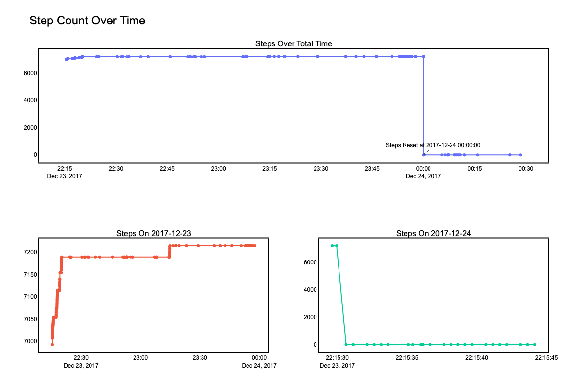
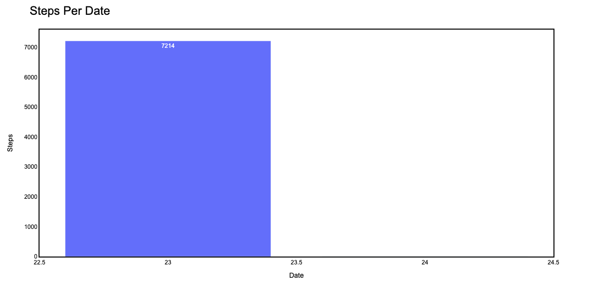
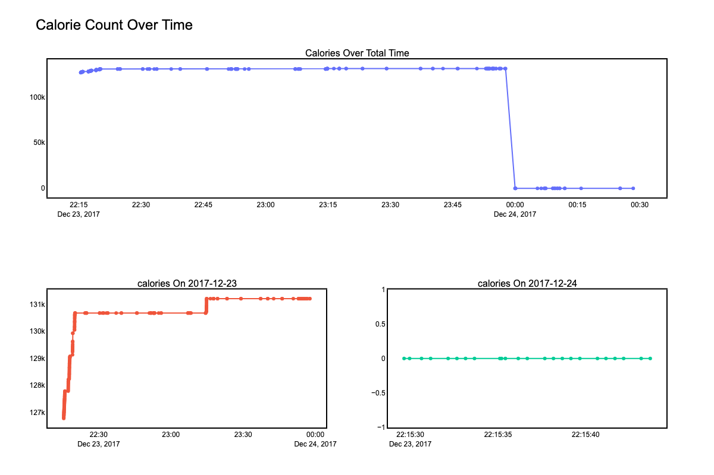
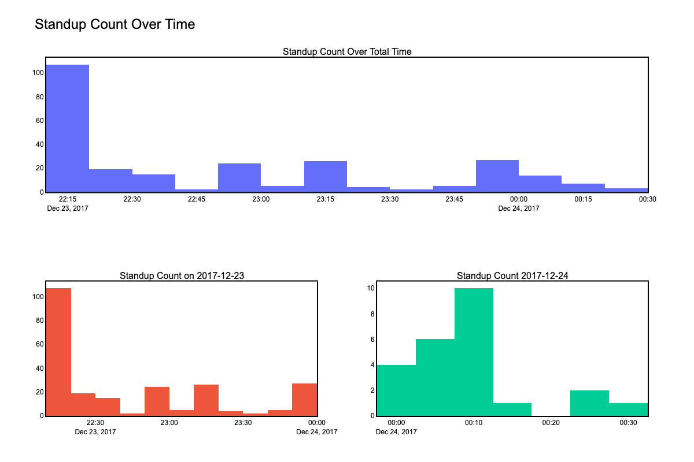
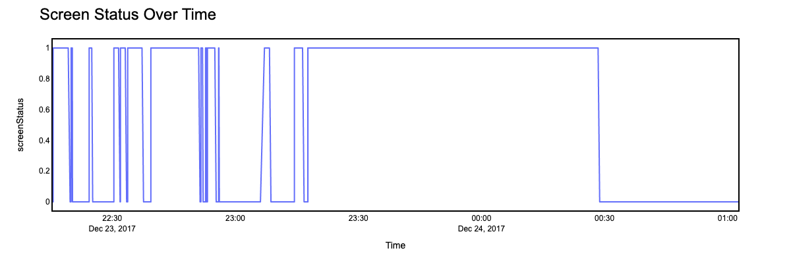
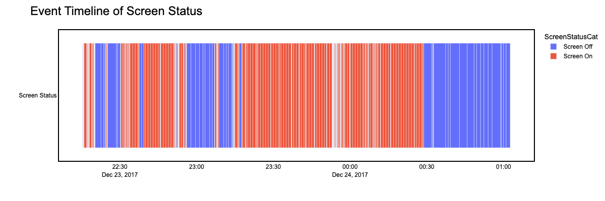
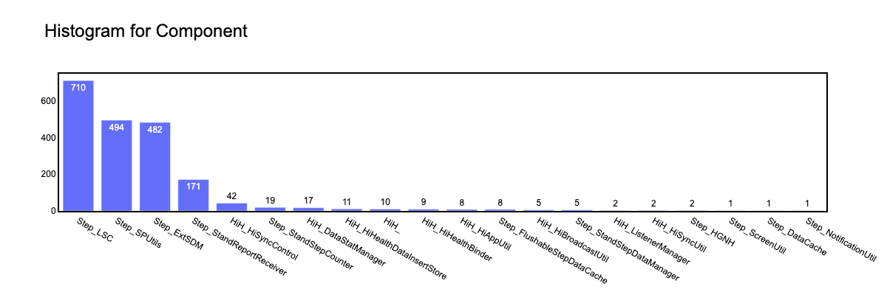
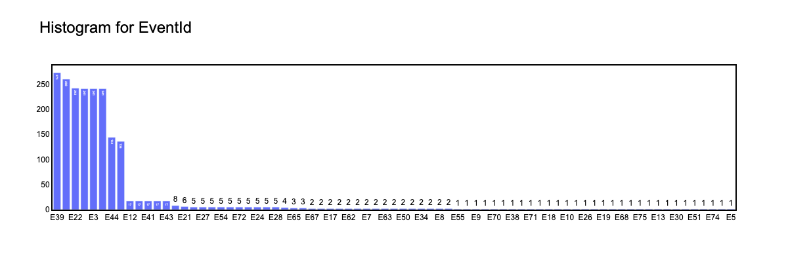

## HealthApp

### Description

This repository contains analysis done on log data from a health app which is a mobile application for Andriod devices. The different ways to look at the analysis and they are as follows:
1. run the code blocks in `analysis.ipynb` notebook
2. run the dash app by running the `app.py`
3. run the dockerised version of the dash app by following the steps below

### Data

#### Overview
This dataset represents logs from a health app, spanning a total duration of 2 hours, 47 minutes, and 6 seconds. The logging period starts on December 23, 2017, at 22:15:29 and concludes on December 24, 2017, at 01:02:35.

##### Log Structure
Each log entry is structured with the following fields:

1. LineId: A unique identifier for each log entry.
2. Time: The timestamp when the log was recorded, formatted as YYYYMMDD-HH:MM:SS:ms.
3. Component: Indicates the specific component of the health app that generated the log.
4. Pid: The Process ID associated with the log entry.
5. Content: Contains the detailed log message.
6. EventId: A code used to categorize the type of event being logged.
7. EventTemplate: A template format illustrating how the log message in Content is structured.

#### Sample Log Entries


|LineId|Time                 |Component               |Pid     |Content                                                                       |EventId|EventTemplate                                                      |
|------|---------------------|------------------------|--------|------------------------------------------------------------------------------|-------|-------------------------------------------------------------------|
|1     |20171223-22:15:29:606|Step_LSC                |30002312|onStandStepChanged 3579                                                       |E42    |onStandStepChanged <*>                                             |
|2     |20171223-22:15:29:615|Step_LSC                |30002312|onExtend:1514038530000 14 0 4                                                 |E39    |onExtend:<*> <*> <*> <*>                                           |
|3     |20171223-22:15:29:633|Step_StandReportReceiver|30002312|onReceive action: android.intent.action.SCREEN_ON                             |E41    |onReceive action: android.intent.action.SCREEN_ON                  |
|4     |20171223-22:15:29:635|Step_LSC                |30002312|processHandleBroadcastAction action:android.intent.action.SCREEN_ON           |E43    |processHandleBroadcastAction action:android.intent.action.SCREEN_ON|
|5     |20171223-22:15:29:635|Step_StandStepCounter   |30002312|flush sensor data                                                             |E12    |flush sensor data                                                  |
|6     |20171223-22:15:29:635|Step_SPUtils            |30002312| getTodayTotalDetailSteps = 1514038440000##6993##548365##8661##12266##27164404|E22    |getTodayTotalDetailSteps = <*>##<*>##<*>##<*>##<*>##<*>            |
|7     |20171223-22:15:29:636|Step_SPUtils            |30002312|setTodayTotalDetailSteps=1514038440000##7007##548365##8661##12361##27173954   |E58    |setTodayTotalDetailSteps=<*>                                       |
|8     |20171223-22:15:29:636|Step_LSC                |30002312|onStandStepChanged 3579                                                       |E42    |onStandStepChanged <*>                                             |
### EDA

We first check for any missing values in the dataset and looking at the table below there were no missing values

|Index|Time                 |Component               |Pid     |Content                                                                       |EventId|EventTemplate                                                      |Date|
|------|---------------------|------------------------|--------|------------------------------------------------------------------------------|-------|-------------------------------------------------------------------|----|
|0     |0                    |0                       |0       |0                                                                             |0      |0                                                                  |0   |


Figure 1: Line plot of total steps taken over the time period with a reset a few miliseconds into the second day.


Figure 2: Bar Plot showing the total steps taken each day


Figure 3: Plot of total calories over the time period. Looking at the below plot one issue that arises is that the total calory count is abnormaly high for an individual as the values are > 1*10^5 as the normal daily calorie intake of a human is 1200-3000, we can also see that the value is not accumulated over the whole timeframe of the logs as the totalCalories value is reset to 0 at midnight


Figure 4: Histograms of measuring the amount of times a user stood up during a time interval of 10 minutes


Figure 5: The screen status vs time with a 1 representing that sceen was on and a 0 representing that the screen was off


Figure 6: The timeline view of the screen status with screen off shown in blue and screen on shown in red


Figure 7: Histogram showing frequency of component being used


Figure 8: Histogram showing frequency of event id being invoked


##### Steps to run the docker container for the dash app 
###### Setup and Running Instructions

This guide provides step-by-step instructions on how to set up and run the Player Analysis Dashboard using Docker.

###### Prerequisites
Before proceeding, ensure you have Docker installed on your system. If not, you can download and install Docker from [Docker's official website](https://docs.docker.com/get-docker/).

* Step 1: Build the Docker Container
First, you need to build the Docker container. Open your terminal or command prompt and run the following command:

```bash
docker build -t <name-of-container> .
```
Replace <name-of-container> with your desired container name. This command builds a Docker image based on the Dockerfile in the current directory.

* Step 2: Run the Docker Container
After building the image, you can run the container using:

```bash
docker run -p <port:port> <name-of-container>
```
Replace <port:port> with the desired port mapping (e.g., 8080:8080). The format is host-port:container-port. Ensure the port you choose is free on your host machine.

* Step 3: Access the Dashboard
Once the container is running, open a web browser and visit:

```makefile
localhost:<port>
```
Replace <port> with the host port you specified in the previous step. This will take you to the Player Analysis Dashboard.

#### Troubleshooting

If you encounter any issues, ensure that:

Docker is running on your system.
* The ports you specified are not being used by another service.
* The Dockerfile is correctly set up in your working directory.
* For more detailed Docker commands and troubleshooting, refer to the [Docker documentation](https://docs.docker.com/).


### Download
The raw logs are available for downloading at https://github.com/logpai/loghub.

### Citation
If you use this dataset from loghub in your research, please cite the following papers.
+ Jieming Zhu, Shilin He, Pinjia He, Jinyang Liu, Michael R. Lyu. [Loghub: A Large Collection of System Log Datasets for AI-driven Log Analytics](https://arxiv.org/abs/2008.06448). IEEE International Symposium on Software Reliability Engineering (ISSRE), 2023.# healthapp-log-analysis
